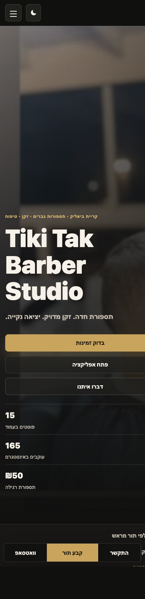
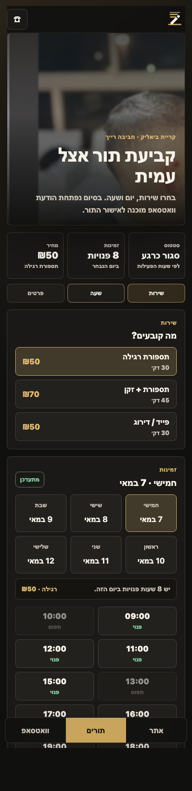
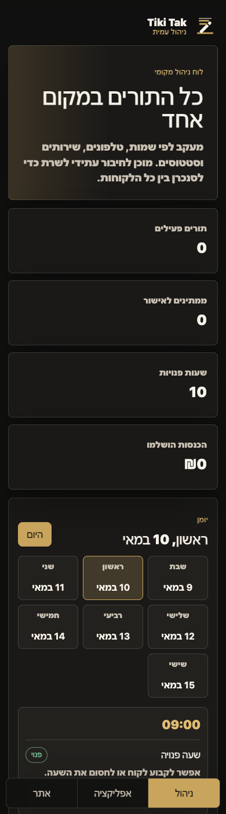

# Tiki Tak Barber Studio

Public visual showcase.

## Overview

Tiki Tak Barber Studio is a Hebrew, mobile-first barber website and booking experience.

The project includes:

- Landing page for the barber studio.
- Appointment request flow.
- WhatsApp handoff with booking details.
- Mobile PWA-style app screen.
- Admin view for appointments and availability.
- Gallery and brand visuals.
- Front-end helper for common questions.

## Screens

  
  
  

## My Work

I built the website structure, responsive mobile interface, booking flow, app-style page, admin screen, visual assets integration and Hebrew content flow.

## Access Note

This repository is for presentation. It shows the product and user experience without needing visitors to inspect the full source project.
